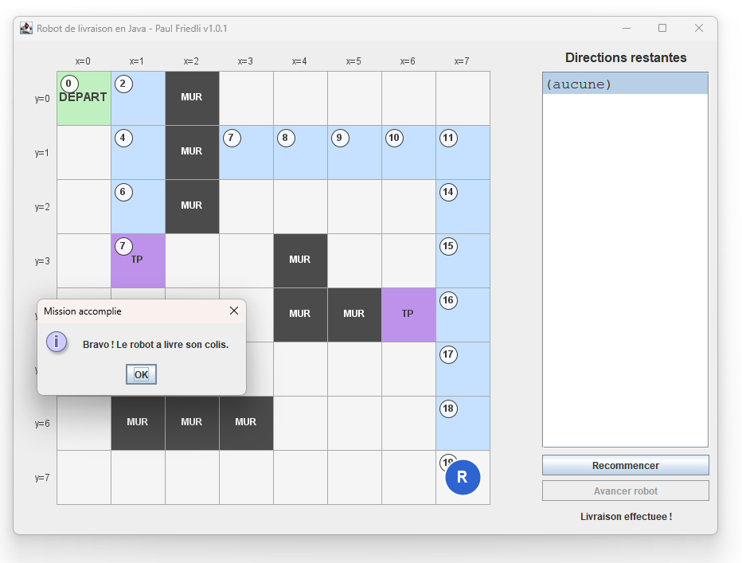
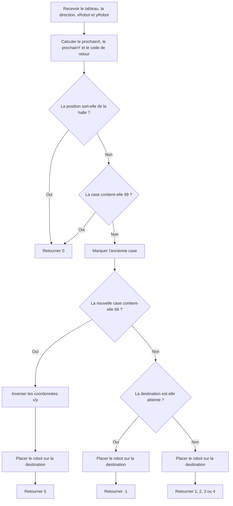

# Robot de livraison — exercice Java

Exemple d'affichage :



## Objectif

Vous devez programmer **une seule méthode** :

```java
public static int deplacerRobot(int[][] halleDeStockage,
                                char direction,
                                int xRobot,
                                int yRobot)
```

Elle se trouve dans le fichier :

```text
src/RobotApprenti.java
```

**Vous ne devez modifier aucun autre fichier du projet.**

L'interface graphique, les boutons, le choix des missions, l'affichage de la halle et la vérification de votre résultat sont déjà programmés.

---

## Ce que fait le programme

Le robot commence toujours en **(x=0, y=0)**.

Lorsque vous cliquez sur **Recommencer**, le programme :

1. remet la halle dans son état initial ;
2. remet le robot en `(0,0)` ;
3. choisit au hasard une mission parmi **10 chemins possibles (des suites de directions pré-enregistrées)** ;
4. affiche à droite les directions qui restant encore à exécuter.

Lorsque vous cliquez sur **Avancer robot**, le programme appelle votre méthode :

- `int deplacerRobot(int[][] halleDeStockage, char direction, int xRobot, int yRobot)` avec :

  - le tableau `halleDeStockage`
  - la prochaine `direction` que le robot doit prendre
  - la coordonnée actuelle `x` et `y` actuelle du robot

Votre méthode doit :

1. vérifier que le robot peut faire ce qui lui est demandé
2. modifier correctement le tableau `halleDeStockage` pour montrer où le robot était et où il se trouve désormais
3. retourner un nombre indiquant ce qui s'est passé, le mouvement qui a été effectué par le robot

Le programme fourni contrôle ensuite votre résultat et redessine la halle.

Le chemin parcouru est coloré. Chaque case visitée affiche aussi le **numéro de l'ordre** qui a amené le robot sur cette case, en commençant par le numéro `0`.

Si un ordre est impossible (par exemple on bute contre un mur infranchissable ou la direction ferait sortir de la halle), aucun nouveau numéro n'est ajouté sur la grille : il peut donc y avoir un saut dans la numérotation.

Lors d'une téléportation, le même numéro apparaît sur la case `TP` franchie et sur la case où le robot réapparaît. Cela permet de visualiser directement le saut effectué.

---

# 1. Représentation de la halle

La halle est un tableau a deux dimensions :

```java
int[][] halleDeStockage;
```

On accède à une case avec :

```java
halleDeStockage[y][x]
```

>[!CAUTION]
>Attention : **y vient avant x** dans le tableau `halleDeStockage`.

Chaque nombre dans les cellules de ce tableau a une signification :

| Valeur | Signification |
| ---: | --- |
| `0` | case vide |
| `1` | position actuelle du robot |
| `2` | case déjà parcourue par le robot |
| `10` | position de départ du robot |
| `11` | position à atteindre pour effectuer la livraison |
| `66` | mur de téléportation |
| `99` | mur infranchissable |

La halle mesure **8 × 8 cases**.

Les coordonnées valides vont donc de `0` à `7`.

---

# 2. Directions possibles

La variable `direction` contient un caractère :

| Direction | Effet |
| --- | --- |
| `'E'` | x augmente de 1 |
| `'N'` | y diminue de 1 |
| `'O'` | x diminue de 1 |
| `'S'` | y augmente de 1 |

Par exemple, si le robot est en position `(x,y)` à ces valeurs `(3,4)` et qu'il reçoit la direction `'E'`, la case qu'il souhaite atteindre est aux coordonnées `(4,4)`.

---

# 3. Valeur que votre méthode doit retourner

Votre méthode doit ensuite retourner exactement une des valeurs suivantes pour indiquer ce que le robot a fait, le déplacement qu'il a effectué :

| Retour | Signification |
| ---: | --- |
| `0` | le robot est resté sur place |
| `1` | le robot est allé vers l'EST |
| `2` | le robot est allé vers le NORD |
| `3` | le robot est allé vers l'OUEST |
| `4` | le robot est allé vers le SUD |
| `5` | le robot s'est téléporté |
| `-1` | la livraison est effectuée |

---

# 4. Cas où le robot ne bouge pas

Le robot doit rester sur place si la direction demandée :

- le ferait sortir de la halle
- le ferait entrer dans une case contenant `99` (mur infranchissable)

Dans ce cas :

- **le tableau ne doit pas etre modifie**
- votre méthode retourne `0` (pour indiquer que le robot reste sur place)

Exemple :

```text
Robot en (0,0)
Direction : NORD

La prochaine position serait (0,-1).
Cette position n'existe pas.

=> le robot reste en (0,0)
=> retour : 0
```

---

# 5. Déplacement normal

Lorsqu'un déplacement est possible :

1. la case que le robot quitte devient `2`
2. la nouvelle case du robot devient `1`
3. la méthode retourne le code correspondant à la direction qui a été prise

---

# 6. Arrivée

La destination est atteinte lorsque le robot atteint une case qui contient `11`.

Lorsque le robot atteint cette case :

- on fait ce qu'on fait lors d'un déplacement normal (voir point précédent)
- votre méthode retourne `-1` pour indiquer que la livraison est effectuée, que la mission est terminée.

---

# 7. Téléportation

Une case contenant un `66` est un téléporteur.

Le robot qui tombe sur une telle case située en `(x, y)` ne reste pas sur cette case, il réapparaît immédiatement aux coordonnées inversées `(y, x)`.

## 7.1 Exemple

Le robot entre dans le téléporteur :

```text
(x=1, y=3)
```

Il réapparaît donc en :

```text
(x=3, y=1)
```

Dans ce cas :

- l'ancienne case du robot devient une trace de passage `2`
- la case `66` reste `66`
- la case d'arrivée du téléport devient `1`
- votre méthode doit retourner `5` pour indiquer que le robot a été téléporté

---

# 8. Schéma général de votre algorithme



---

# 9. Vue simplifiée de la halle

La disposition des obstacles est toujours la meme.

```text
       x=0  x=1  x=2  x=3  x=4  x=5  x=6  x=7

y=0     D         ##
y=1               ##
y=2               ##
y=3          TP             ##
y=4                         ##   ##  TP
y=5
y=6          ##   ##    ##
y=7                                         A
```

Légende :

```text
D   = départ
A   = arrivée
##  = mur infranchissable (99)
TP  = téléporteur (66)
```

Le téléporteur principal se trouve en `(1,3)` et envoie donc le robot en `(3,1)`.

---

# 10. Conseil de résolution

Utilisez la solution que je vous ai transmise (le programme qui fonctionne) pour utiliser le programme qui fonctionne et vous inspirer du comportement attendu.

Commencez par regarder avec attention le schéma fourni au §8, il vous donne la marche à suivre pour le codage.

Vous n'avez pas besoin de créer d'autre méthode ni d'utiliser des objets.

---
